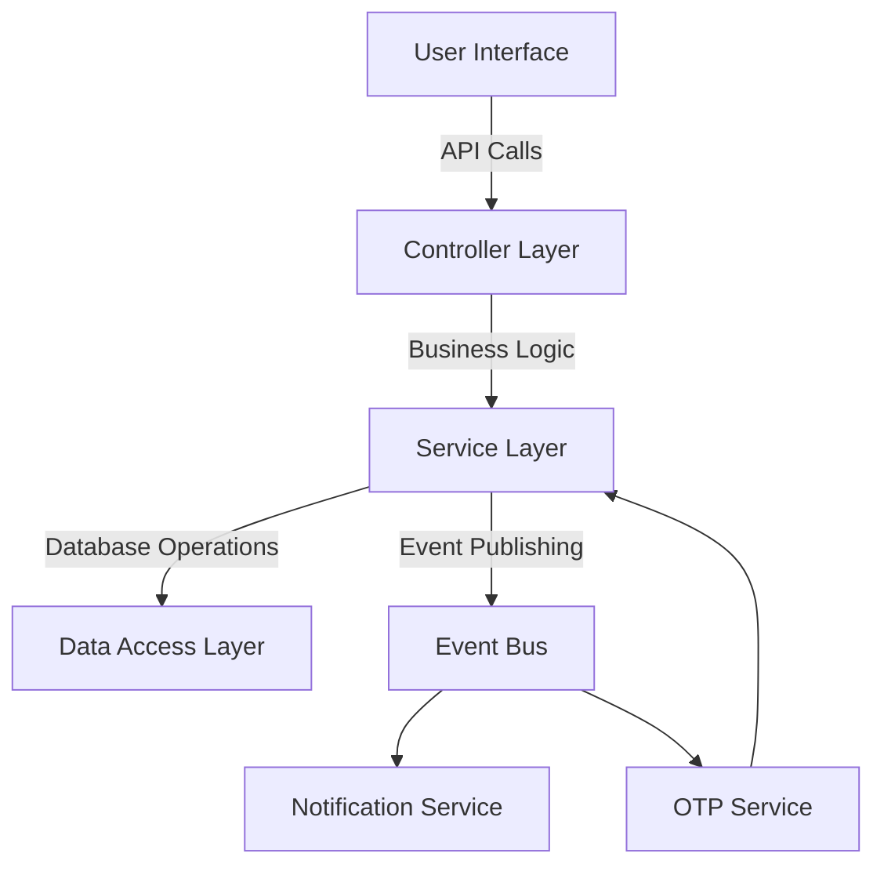

# Webank UserApp - Technical Documentation

## Overview

The Webank UserApp is a mobile-first banking application that allows users to create accounts, manage funds, and perform transactions. The core technical objectives for this documentation are to:

- [Describe a secure front-end-backend communication layer](#secure-front-end-to-back-end-communication)
- [Outline event bus communication for internal application messaging](#event-bus-communication)
- [Demonstrate component and service abstractions between the frontend and backend](#abstraction-of-frontend-backend-components)

## Technologies Used

### Frontend (React):
- **ReactJS**: Component-based framework for UI.
- **TypeScript**: For static typing.
- **Tailwind CSS**: Utility-based CSS framework.
- **React Router**: Manages navigation between screens.
- **Event Bus (e.g., Kafka, RabbitMQ)**: Manages asynchronous messaging and event-driven communication.
- **Axios/Fetch API**: For API requests.
- **RESTful APIs**: Primary communication layer with the frontend.
- **JWT (JSON Web Tokens)**: For secure user authentication and API access.
- **SSL/TLS**: For encrypting communication between client and server.

## Secure Front-End to Back-End Communication
To establish a secure communication channel between the Webank application, we can implement the following layers:

### Authentication and Authorization:
- **JWT Authentication**: JWT tokens generated at login, stored securely (e.g., in HttpOnly cookies), and included in request headers for subsequent requests.
- **Role-Based Access Control (RBAC)**: Enforces permissions to prevent unauthorized actions based on user roles (e.g., admin, user).

### Secure API Design:
- **HTTPS/SSL**: All communications must use HTTPS to protect data in transit.
- **API Rate Limiting**: Limits excessive requests from the same IP to prevent DDoS attacks.
- **Input Validation and Sanitization**: Protects against SQL Injection and XSS attacks by sanitizing inputs.

## Event Bus Communication

An event bus facilitates communication across application components and services asynchronously. This pattern is beneficial for handling high-traffic events such as  OTP verification and user notifications

## Example Events
#### registration_request Initiates the registration process and OTP generation.

### OTP Generation:
1. When a user registers, the frontend triggers a `registration_request` event that includes the user’s phone number.
2. The backend listens for this event and invokes the OTP service to generate and send an OTP.
3. Upon successful OTP generation, an `otp_sent` event is published on the event bus to confirm that the OTP was sent, enabling other services or the UI to take the next action.

#### otp_verification_request : Triggers OTP verification for the user.

### OTP Verification:
1. After the user enters the OTP, the frontend sends an `otp_verification_request` event containing the OTP and user information.
2. The backend verifies the OTP. If valid, it publishes an `otp_verified` event.
3. The `otp_verified` event could be used to:
   - Update the user’s registration status.
   - Send a welcome notification to the user.
4. Upon successful verification, the UI redirects the user to the dashboard, where they can view their balance.

### Show Balance Inquiry:

The show balance inquiry doesn’t necessarily require an event-driven model since it’s a simple data retrieval operation. Instead, this is handled by the backend responding directly to the frontend request for balance data.

## Abstraction of Frontend-Backend Components

Abstraction between the frontend and backend components ensures separation of concerns and decouples the frontend from direct business logic. This is achieved by creating well-defined API interfaces and utilizing data transfer objects (DTOs) to structure the data exchanged.

### FE-BE Component Structure

#### Frontend Components:
- **API Layer**:
  - **Axios Interceptors**: For token injection and error handling on API calls.
  - **DTOs**: Define data structure expectations.
  
- **State Management**:
  - Use libraries like Redux for a single source of truth.
  - Local state management within components, e.g., for input form control.

#### Backend Components:

- **Controller Layer**:
  It serves as an intermediary between the UI (Frontend) and the Service Layer within the backend. It processes incoming requests from the UI, routes them to the correct services, and returns the appropriate responses. Here’s a breakdown of its role:
  - Handles HTTP requests, validates inputs, and forwards requests to services.
  - It ensures that incoming data is valid and secure. For instance, if the UI sends a request to initiate a transaction, the controller checks that all   required fields are present and correctly formatted.
  - It listens for incoming HTTP requests (such as POST, GET) from the frontend or other clients and directs them to the appropriate backend services
## Service Layer
The Service Layer in the Webank UserApp backend is responsible for implementing the core business logic and coordinating requests between the Controller Layer (exposing APIs to the frontend) and other backend services, like databases and messaging systems (e.g., the Event Bus). This layer provides a clean separation of concerns, ensuring that the business logic is reusable, maintainable, and decoupled from the underlying technology stack.

## Key Responsibilities of the Service Layer:
### Business Logic Processing
- **User Registration** 
Handles user signup by generating OTPs, validating user input, and coordinating event publishing.
- **User Balance Retrieval** 
Retrieves and formats account balance data for display in the UI.
### Interfacing with the Database
The Service Layer interacts with the Data Access Layer (DAL) to retrieve and persist data, such as user accounts, transaction histories, etc.

### Publishing Events: 
Publishes events to the Event Bus (e.g., "otp_sent", "otp_verified") for asynchronous actions like sending notifications or logging.

### Service-to-Service Communication
 Coordinates with external services like the OTP service for generating and verifying OTPs. This communication is also abstracted for consistency and simplicity within the Service Layer.
## Event Listener Layer:
  - Listens to event bus messages, triggers relevant services.

   ## Interaction Diagram

### Explanation of Flow
1. **UI to Controller**:  The user interface initiates requests (e.g., registration or balance inquiry) via the Controller Layer.
   
2. **Controller to Service**:The Controller passes the request to the Service Layer for processing.
3. **Service Layer to DAL**: For database-dependent requests, the Service Layer accesses the Data Access Layer to retrieve or store data.

4. **Service Layer to Event Bus**:  Once the core processing is complete, the Service Layer may publish relevant events on the Event Bus.

5. **Event Bus to Services**: The Event Bus notifies services, such as the Notification or OTP Service, to handle asynchronous tasks.

6. **OTP Service to Service Layer**:For OTP generation or verification, the OTP Service communicates directly with the Service Layer.

## Error Handling in the Webank App
The Webank app strives to provide a smooth user experience by gracefully handling errors that might occur during communication with the back-end server. Here's how the app will address potential issues:

Types of Errors:

- Network Errors: These occur when the user's device loses internet connectivity or cannot establish a connection to the server.
- Server Errors: These can happen due to issues on the back-end server, such as high load, bugs, or maintenance.
- API Errors: Errors returned from the back-end APIs due to invalid data formats, unauthorized access attempts, or other API-specific issues.
- User Errors: Errors returned when the user mistakes in data entry or interaction with the app's functionalities.

**Common API Errors:**
- *400 Bad Request:* This error typically indicates that the request sent by the webank app to the back-end API contains invalid data or a parameter is missing.
  Common causes might be missing required fields in the request body, incorrectly formatted data (e.g., wrong date format, invalid characters in names), or exceeding character limits for specific fields.

- *404 Not Found:* This error indicates that the resource (e.g., user data, transaction history) requested by the app is not found on the back-end server.
  This could be due to a typo in the API endpoint URL, referencing a non-existent user ID, or temporary server issues.

- *403 Forbidden:* This error signifies that the user associated with the request is authorized but doesn't have the necessary permissions to perform the specific action.

- *500 Internal Server Error:* This generic error signifies a problem on the back-end server preventing it from fulfilling the request.
  This could be due to server overload, bugs in the back-end code, or database issues.