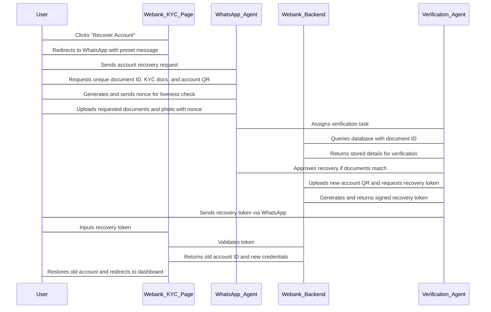

# Account Recovery Process - Webank

## Overview
The account recovery process allows users who have lost their device (and thus access to their account) to reclaim their previous account after verifying their identity. This is done through a structured KYC process involving interaction with a Webank agent via WhatsApp.

## Process Flow

1. **Initiate Registration**
   - There is no explicit "Recover My Account" button on the sign-up page.
   - The user begins the standard registration process as if creating a new account.

2. **KYC and Account Recovery Button**
   - On the KYC page, there is a "Recover Account" button.
   - Clicking this button redirects the user to WhatsApp using a `wa.link` to chat with a Webank agent.
   - A predefined message is automatically written for the user: _"I want to recover a lost account via KYC."_

3. **Interaction with the Webank Agent (or Automated Bot)**
   - The agent or bot provides detailed recovery instructions:
     - The user must send the **unique document identifier** associated with their previous account's verification document.
     - The user must upload all required KYC documents, ensuring they match those used in the previous account's verification.
     - The user must upload the **account QR** of their newly created account.
     - A **random nonce (unique string/number)** is generated and included in the instructions.
       - The user is instructed to take a picture holding a paper with this nonce clearly visible and upload it along with the other required documents.
       - This step ensures the liveness of the recovery process and prevents fraudulent recovery attempts using stolen images.

4. **Verification by a Random Agent**
   - The recovery verification is assigned to a **random Webank agent** in the background.
   - This ensures that no specific agent can deliberately approve fraudulent account recoveries in collusion with unauthorized individuals.

5. **Agent Verification Process**
   - The agent inputs the provided **unique document ID** into a special UI.
   - The backend queries the database for the personal details and documents linked to this ID.
   - The queried information is displayed on a verification page for comparison with the documents received via WhatsApp.
   - If the documents match, the agent clicks an **Approve** button.
   - The agent is prompted to upload the **account QR** of the user's new account.
   - Upon uploading, a button appears labeled **Generate Recovery Token**.

6. **Recovery Token Generation**
   - Clicking the **Generate Recovery Token** button sends a request to the backend.
   - The backend creates an **authentication token** containing:
     - The **account ID** of the old account.
     - The **account ID** of the new account (ensuring only the new account can use the token to reclaim the old one).
     - The **backend’s signature** certifying the token's authenticity.
     - A **timestamp** to enforce token validity limits.
   - The token is returned to the agent, who can copy it and send it to the user via WhatsApp.

7. **User Validation and Account Restoration**
   - The user copies the received token and returns to the KYC page.
   - Clicking "Recover Account" again now presents a **Validate Account Recovery via Token** option.
   - The user is directed to a page with an input field to enter the recovery token.
   - Clicking **Validate** sends a final request to the backend.

8. **Backend Response & Account Restoration**
   - If validation is successful, the backend returns:
     - The **account ID** of the old recovered account.
     - An **account certificate** bound to the old account ID but linked to the new device’s public key.
     - A **KYC certificate** confirming verification.
   - The frontend updates the user’s stored account information.
   - The user is redirected to the recovered account’s dashboard with a success message: _"Account recovery successful. Redirecting to your past account dashboard... Enjoy!"_

## Sequence Diagram

The following sequence diagram visually illustrates the step-by-step account recovery process:

## Security Measures
- **Randomized Agent Verification**: Recovery is handled by a randomly assigned agent to prevent collusion and unauthorized approvals.
- **Nonce for Liveness Check**: The recovery instructions include a unique nonce requiring the user to submit a live picture holding it, ensuring real-time identity verification and preventing document theft-based fraud.
- **Signature & Timestamp in Token**: Ensures authenticity and time-restricted validity of recovery operations.

This process ensures a secure and seamless way for legitimate users to reclaim their lost accounts while preventing fraud.