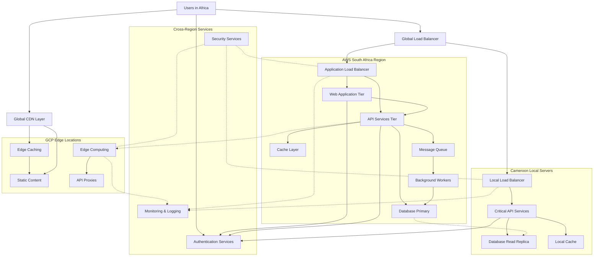
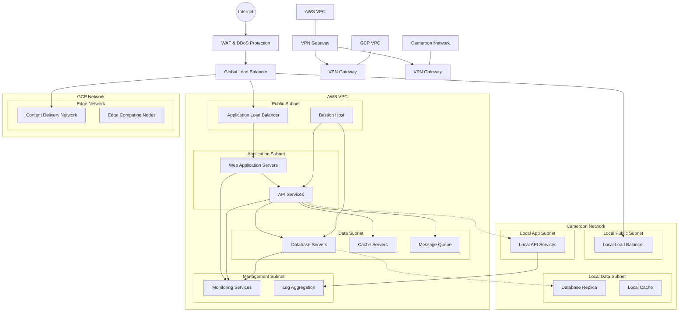
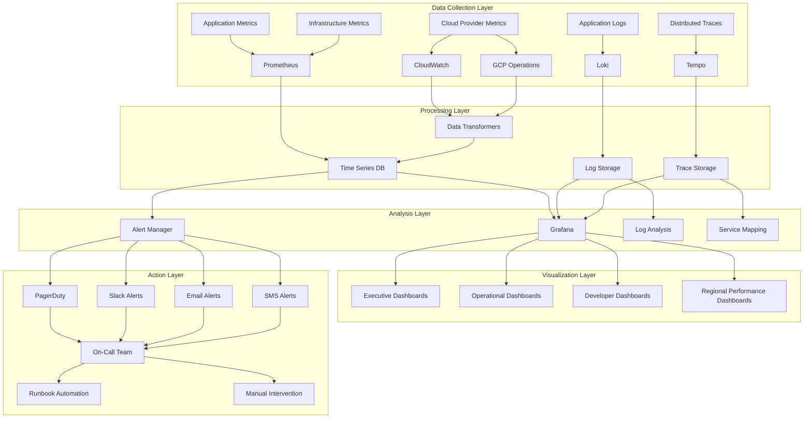
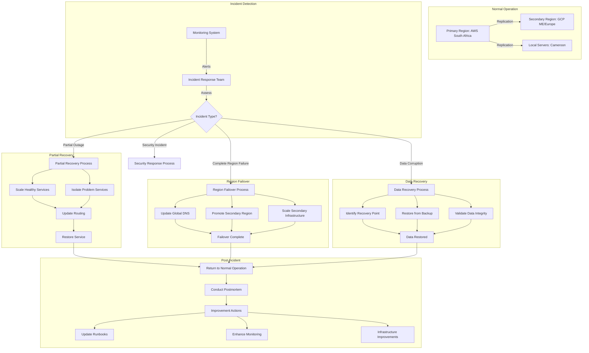

# Web Application Deployment Architecture Document
## African Market Deployment Strategy

### Executive Summary

This document outlines a comprehensive deployment architecture and strategy for launching a web application primarily targeted at the African continent. The strategy includes detailed plans for infrastructure setup, environment management, monitoring systems, quality assurance, rollback procedures, beta launch support, and post-beta evaluation. Special consideration is given to the unique challenges and opportunities presented by deploying across the African market, including internet connectivity variability, regional regulations, and infrastructure reliability.

---

## Table of Contents

1. [Infrastructure Strategy & Provider Analysis](#1-infrastructure-strategy--provider-analysis)
2. [Deployment Architecture Overview](#2-deployment-architecture-overview)
3. [Environment Setup & Pipeline Configuration](#3-environment-setup--pipeline-configuration)
4. [Monitoring & Observability Strategy](#4-monitoring--observability-strategy)
5. [Quality Assurance Environment & Practices](#5-quality-assurance-environment--practices)
6. [Rollback & Disaster Recovery Plan](#6-rollback--disaster-recovery-plan)
7. [Beta Launch & Support Strategy](#7-beta-launch--support-strategy)
8. [Post-Beta Evaluation Framework](#8-post-beta-evaluation-framework)
9. [Regional Optimization Strategy](#9-regional-optimization-strategy)
10. [Security & Compliance Considerations](#10-security--compliance-considerations)
11. [Project Timeline & Milestones](#11-project-timeline--milestones)

---

## 1. Infrastructure Strategy & Provider Analysis

### Cloud Provider Comparison

#### AWS
**Pros:**
- Extensive global infrastructure with regions in South Africa and planned expansion
- Comprehensive service catalog for every aspect of application deployment
- Well-established support for high-availability architectures
- Advanced networking features for global traffic management
- Strong security and compliance certifications

**Cons:**
- Higher latency for users in Central/West Africa from existing regions
- Potentially higher costs compared to local solutions
- Complex pricing structure that can lead to unexpected costs
- Learning curve for teams not familiar with AWS ecosystem

#### GCP
**Pros:**
- Edge locations in multiple African countries for improved content delivery
- Simplified networking configuration with automatic global load balancing
- Strong data analytics tools that may benefit future application development
- Often better price-performance ratio than AWS for certain workloads
- Good autoscaling capabilities to handle variable traffic

**Cons:**
- No dedicated African regions yet (nearest regions in Europe/Middle East)
- Fewer services compared to AWS (though core services are robust)
- Less market penetration in Africa, potentially affecting support
- Bandwidth costs could be higher for African users

#### Personal Servers in Cameroon
**Pros:**
- Lowest latency for users in Cameroon and neighboring countries
- Potentially lower operating costs compared to cloud providers
- Direct control over hardware and infrastructure
- No data transfer costs for local users
- Potential regulatory advantages for local data residency requirements

**Cons:**
- Limited scalability compared to cloud providers
- Higher risk of downtime without redundant infrastructure
- Manual maintenance and hardware replacement requirements
- Challenging to implement global high availability
- Likely higher capital expenditure upfront
- Power reliability and connectivity issues to manage

### Recommended Hybrid Approach

Based on the analysis and considering the primary focus on the African market, we recommend a hybrid deployment approach:

1. **Primary Infrastructure**: AWS with South Africa region as the main deployment
2. **Edge Presence**: GCP's CDN for static content delivery leveraging their edge locations
3. **Local Presence**: Supplementary servers in Cameroon for critical services requiring low latency

This hybrid architecture provides:
- Reliable core infrastructure with AWS's mature services
- Optimized content delivery via GCP's edge network
- Ultra-low latency for critical operations via local servers
- Redundancy across multiple providers for disaster recovery
- Compliance with potential data sovereignty requirements

### Critical Questions for Infrastructure Strategy

1. What are our latency requirements for different components of the application?
2. What are the regulatory requirements for data storage in target African countries?
3. What is our expected traffic pattern and growth trajectory?
4. What is our budget allocation between operational and capital expenditures?
5. Do we have the technical expertise to manage a multi-provider architecture?
6. What are our minimal viable redundancy requirements?
7. How do we ensure secure connectivity between distributed infrastructure components?
8. What is our strategy for regions with unreliable internet connectivity?

---

## 2. Deployment Architecture Overview

### Overall Architecture

Our architecture follows a distributed, microservices-based approach designed to balance reliability, performance, and cost-effectiveness across multiple environments.

#### Core Architectural Components

1. **Multi-Region Load Balancing**
   - Global traffic manager to route users to nearest available infrastructure
   - Health checks with automatic failover between regions
   - Intelligent routing based on latency and availability

2. **Edge Layer**
   - CDN for static assets and cacheable content
   - Edge computing for location-specific processing
   - Local caching to reduce bandwidth requirements

3. **Application Layer**
   - Containerized microservices for core business logic
   - Auto-scaling based on demand patterns
   - Stateless design for horizontal scalability

4. **Data Layer**
   - Distributed database with regional replication
   - Caching layer for frequent queries
   - Data synchronization strategy between regions

5. **Offline Capabilities**
   - Progressive Web App (PWA) implementation
   - Local-first data operations with background sync
   - Degraded functionality modes for poor connectivity

### Deployment Regions & Infrastructure Distribution

| Component | AWS (Primary) | GCP (Edge) | Cameroon (Local) |
|-----------|--------------|------------|------------------|
| Frontend Static Assets | ✓ (S3) | ✓ (CDN) | ✓ (Limited) |
| API Services | ✓ (ECS/EKS) | ⚠️ (Backup only) | ✓ (Critical paths) |
| Database Primary | ✓ (RDS/DynamoDB) | ❌ | ❌ |
| Database Replicas | ✓ | ❌ | ✓ (Read replicas) |
| Caching Layer | ✓ (ElastiCache) | ✓ (Memorystore) | ✓ (Local) |
| Background Jobs | ✓ (SQS/Lambda) | ❌ | ⚠️ (Non-critical only) |
| Monitoring & Logging | ✓ (CloudWatch) | ✓ (Operations) | ✓ (Local Grafana) |

### Network Architecture

The network architecture implements a secure, multi-layered approach:

1. **Public-Facing Layer**
   - WAF and DDoS protection
   - TLS termination and inspection
   - Rate limiting and bot protection

2. **Application Networking**
   - Private subnets for application components
   - Security groups and NACLs for access control
   - Service mesh for inter-service communication

3. **Data Networking**
   - Encrypted VPC peering between clouds
   - Private links for database access
   - Zero-trust network access for operations

4. **Management Networking**
   - Isolated admin VPC
   - Bastion hosts with MFA
   - Separate monitoring network

### Critical Questions for Architecture Design

1. How will we handle data synchronization between distributed database instances?
2. What is our strategy for managing microservice dependencies across regions?
3. How will we ensure consistent user experiences despite infrastructure differences?
4. What fallback mechanisms will we implement for component failures?
5. How will authentication and authorization work across distributed systems?
6. What is our strategy for managing application state in a distributed architecture?
7. How will we handle database schema migrations across distributed databases?
8. What is our approach to implementing circuit breakers and graceful degradation?

---

## 3. Environment Setup & Pipeline Configuration

### Environment Strategy

We will implement four distinct environments to ensure proper isolation and testing:

1. **Development Environment**
   - Purpose: Daily development and integration testing
   - Infrastructure: Simplified AWS deployment with mocked services
   - Data: Synthetic test data, no production data
   - Access: Development team only

2. **QA/Testing Environment**
   - Purpose: Formal QA, performance testing, and UAT
   - Infrastructure: Close mirror of production with scaled-down resources
   - Data: Anonymized production-like data
   - Access: QA team, product managers, selected stakeholders

3. **Staging Environment**
   - Purpose: Pre-production verification and final acceptance
   - Infrastructure: Exact mirror of production architecture
   - Data: Sanitized production data clone
   - Access: Release managers, QA leads, operations team

4. **Production Environment**
   - Purpose: Live application serving real users
   - Infrastructure: Full hybrid architecture (AWS, GCP, Cameroon)
   - Data: Production data with strict security controls
   - Access: Operations team only, with break-glass procedures

### CI/CD Pipeline Overview

Our continuous integration and deployment pipeline will incorporate:

1. **Code Integration Phase**
   - Automated tests on PR/commit
   - Static code analysis and security scanning
   - Code quality gates and review requirements
   - Artifact generation and versioning

2. **Testing Phase**
   - Deployment to QA environment
   - Automated integration and E2E tests
   - Performance benchmark tests
   - Security and compliance checks

3. **Approval Phase**
   - QA sign-off process
   - Product owner verification
   - Change advisory board review (if required)
   - Release documentation preparation

4. **Deployment Phase**
   - Blue-green deployment to staging
   - Smoke tests and verification
   - Gradual production rollout (canary deployment)
   - Post-deployment validation

### Infrastructure as Code (IaC)

All infrastructure will be defined using Infrastructure as Code principles:

1. **Core Infrastructure**
   - Terraform for multi-cloud resource provisioning
   - AWS CloudFormation for AWS-specific resources
   - GitOps workflow for infrastructure changes

2. **Application Configuration**
   - Kubernetes manifests for container orchestration
   - Helm charts for application deployment
   - ConfigMaps and Secrets for configuration management

3. **Network Configuration**
   - VPC/subnet definitions in Terraform
   - Security groups and NACLs as code
   - DNS configuration in Route53/Cloud DNS

4. **Policy as Code**
   - IAM policies and roles defined in Terraform
   - RBAC configurations for Kubernetes
   - Service mesh policies for traffic management

### Critical Questions for Environment & Pipeline

1. How do we maintain parity between environments despite infrastructure differences?
2. What are our quality gates for each stage of the pipeline?
3. How do we handle environment-specific configuration securely?
4. What is our strategy for database changes and migrations?
5. How do we manage secrets across multiple providers and environments?
6. What is our approach to feature flags and progressive rollouts?
7. How do we ensure deployment times remain reasonable as the application grows?
8. What are our criteria for automated rollbacks vs. manual intervention?

---

## 4. Monitoring & Observability Strategy

### Monitoring Architecture

We will implement a comprehensive monitoring solution centered around Grafana, with distributed collectors and centralized analysis:

1. **Infrastructure Monitoring**
   - Resource utilization (CPU, memory, disk, network)
   - Cloud service health and quotas
   - Cost monitoring and anomaly detection
   - Infrastructure availability metrics

2. **Application Monitoring**
   - Request rates, errors, and durations (RED)
   - Service-to-service communication
   - Database query performance
   - Cache hit rates and efficiency

3. **End-User Experience Monitoring**
   - Page load times and Time to Interactive (TTI)
   - API response times from user perspective
   - User journey completion rates
   - Apdex scores by region and connection type

4. **Business Metrics Monitoring**
   - Conversion rates and funnel analysis
   - Feature usage statistics
   - Customer engagement metrics
   - Regional usage patterns

### Grafana Implementation

Our Grafana setup will include:

1. **Dashboard Structure**
   - Executive overview dashboards
   - Operational dashboards by service
   - Regional performance dashboards
   - On-call troubleshooting dashboards

2. **Data Sources**
   - Prometheus for metrics collection
   - Loki for log aggregation
   - Tempo for distributed tracing
   - CloudWatch and Google Operations metrics

3. **Alerting Configuration**
   - Multi-level alert thresholds
   - Alert routing based on service and severity
   - Alert grouping to prevent fatigue
   - Automated remediation hooks

4. **Visualization Strategy**
   - Standard visualization patterns for consistency
   - Heat maps for latency distribution
   - Service topology maps
   - Geospatial dashboards for regional analysis

### Log Management

Our logging strategy includes:

1. **Log Collection**
   - Standardized logging format across services
   - Log forwarding from all environments
   - Log enrichment with metadata
   - Sampling strategy for high-volume logs

2. **Log Processing**
   - Real-time log analysis
   - Pattern recognition for anomaly detection
   - Structured logging for machine processing
   - Retention policies by log importance

3. **Log Storage**
   - Tiered storage for hot/warm/cold logs
   - Compliance-focused retention policies
   - Log encryption and access controls
   - Geographic restrictions for sensitive logs

### Critical Questions for Monitoring

1. What are our Service Level Indicators (SLIs) and Objectives (SLOs)?
2. How do we ensure monitoring coverage across our hybrid infrastructure?
3. What alerting thresholds should we set to avoid alert fatigue?
4. How do we correlate issues across distributed systems?
5. What retention periods do we need for different types of monitoring data?
6. How do we handle monitoring in regions with intermittent connectivity?
7. What is our strategy for monitoring costs and controlling monitoring overhead?
8. How do we ensure monitoring security and prevent data leakage?

---

## 5. Quality Assurance Environment & Practices

### QA Environment Architecture

Our QA environment will provide a comprehensive testing platform:

1. **Infrastructure Composition**
   - Scaled-down version of production architecture
   - Full service mesh implementation
   - Configurable network conditions simulator
   - Regional performance simulation capabilities

2. **Data Management**
   - Anonymized production data snapshots
   - Synthetic data generation for edge cases
   - Data reset capabilities between test cycles
   - Automated test data seeding

3. **Test Infrastructure**
   - Dedicated test runner instances
   - Visual regression testing environment
   - Performance testing infrastructure
   - Accessibility testing tools

4. **Isolation Strategy**
   - Separate databases per test suite
   - Test namespaces in Kubernetes
   - Mock external dependencies
   - Service virtualization for third-party APIs

### Testing Strategy

Our testing approach covers:

1. **Functional Testing**
   - Automated API tests
   - End-to-end UI tests
   - Integration tests between services
   - Negative test cases and error handling

2. **Non-Functional Testing**
   - Performance testing under various loads
   - Resilience testing (chaos engineering)
   - Accessibility compliance testing
   - Security and penetration testing

3. **Regional Testing**
   - Geographic distribution simulation
   - Variable network condition testing
   - Internationalization and localization testing
   - Device and browser compatibility testing

4. **Acceptance Testing**
   - User acceptance testing
   - Business scenario validation
   - Regulatory compliance verification
   - Partner integration testing

### Test Automation Framework

Our test automation approach includes:

1. **Test Pyramid Implementation**
   - Unit tests in CI pipeline
   - Service tests for API validation
   - UI tests for critical paths
   - Manual exploratory testing

2. **Automation Tools**
   - Jest/Mocha for unit testing
   - Postman/RestAssured for API testing
   - Cypress/Playwright for UI testing
   - JMeter/k6 for performance testing

3. **Test Data Management**
   - Test data generation framework
   - Seeding scripts for consistent test data
   - Data versioning alongside code
   - Privacy-compliant test data handling

4. **Test Results Management**
   - Centralized test result repository
   - Trend analysis and quality metrics
   - Integration with CI/CD for quality gates
   - Failure analysis and categorization

### Critical Questions for QA

1. How do we efficiently simulate African market conditions in our QA environment?
2. What are our quality gates and acceptance criteria for each release stage?
3. How do we balance automated vs. manual testing efforts?
4. What is our strategy for testing offline functionality and resilience?
5. How do we ensure test data represents diverse African market segments?
6. What performance benchmarks are appropriate for various African regions?
7. How do we validate localization for relevant African languages?
8. What is our approach to testing across diverse device types common in target markets?

---

## 6. Rollback & Disaster Recovery Plan

### Rollback Strategy

Our application employs a comprehensive rollback approach:

1. **Deployment Rollback Types**
   - Blue-green deployment rollback
   - Canary deployment percentage adjustment
   - Configuration rollback
   - Database migration rollback

2. **Rollback Triggers**
   - Error rate threshold exceeded
   - Latency beyond acceptable thresholds
   - Critical business function failure
   - Security incident detection

3. **Rollback Procedures**
   - Automated rollback for deployment issues
   - Database state recovery procedures
   - Communication templates and escalation paths
   - Post-rollback analysis process

4. **Rollback Testing**
   - Regular rollback drills
   - Chaos engineering experiments
   - Database rollback verification
   - Recovery time objective validation

### Disaster Recovery Plan

Our disaster recovery strategy includes:

1. **Recovery Objectives**
   - Recovery Point Objective (RPO): 15 minutes
   - Recovery Time Objective (RTO): 1 hour
   - Regional RTO: 4 hours
   - Complete provider failure RTO: 24 hours

2. **Backup Strategy**
   - Database automated backups (15-minute intervals)
   - Transaction log shipping for point-in-time recovery
   - Cross-region snapshot replication
   - Regular backup restoration testing

3. **Infrastructure Recovery**
   - Infrastructure as Code recovery playbooks
   - Standby environment in secondary region
   - Cross-cloud redundancy for critical services
   - DNS failover configuration

4. **Data Recovery**
   - Database point-in-time recovery procedures
   - Data consistency validation tools
   - Cross-region data synchronization
   - Offline data recovery processes

### Business Continuity Planning

Our business continuity approach includes:

1. **Degraded Mode Operations**
   - Critical vs. non-critical functionality identification
   - Offline capability prioritization
   - Minimal viable service definition
   - Manual override procedures

2. **Communication Plan**
   - Status page and automatic updates
   - Customer notification templates
   - Stakeholder communication procedures
   - Resolution updates and transparency

3. **Incident Response Team**
   - On-call rotation and escalation paths
   - Cross-functional incident team structure
   - Decision-making authority framework
   - External communication responsibilities

4. **Post-Incident Analysis**
   - Blameless postmortem process
   - Root cause analysis methodology
   - Corrective action tracking
   - Incident knowledge base maintenance

### Critical Questions for Rollback & Recovery

1. What is the maximum acceptable data loss for different application components?
2. How do we ensure rollback procedures work across our hybrid infrastructure?
3. What is our strategy for recovering from data corruption vs. infrastructure failure?
4. How do we handle rollbacks that involve database schema changes?
5. What are our procedures for recovering from security incidents?
6. How do we test disaster recovery procedures without risking production?
7. What is our communication plan during prolonged outages?
8. How do we ensure business continuity despite regional connectivity issues?

---

## 7. Beta Launch & Support Strategy

### Beta Release Strategy

Our beta launch approach includes:

1. **Phased Rollout Plan**
   - Internal testing phase (employees)
   - Closed beta (invited partners)
   - Limited geographic beta (selected regions)
   - Open beta (capacity-controlled)

2. **Feature Flag Implementation**
   - Granular feature control
   - User segment targeting
   - A/B testing capability
   - Automatic rollback triggers

3. **Beta User Selection**
   - Demographic diversity across African regions
   - Varying connectivity and device profiles
   - Mix of technical and non-technical users
   - Partner representatives for integration testing

4. **Onboarding Process**
   - Clear expectations documentation
   - Guided first-use experience
   - Feedback mechanism instruction
   - Support channel information

### Beta Support Model

Our support framework during beta includes:

1. **Support Channels**
   - In-app feedback mechanism
   - Beta community forum
   - Direct email support
   - WhatsApp support group
   - Weekly video conference Q&A sessions

2. **Support Team Structure**
   - Tier 1: First response team
   - Tier 2: Technical support specialists
   - Tier 3: Developer escalation team
   - Regional support representatives

3. **Issue Management Process**
   - Centralized issue tracking system
   - Severity and priority classification
   - Response time SLAs by severity
   - Resolution workflow and verification

4. **Knowledge Management**
   - Dynamic FAQ based on common issues
   - Troubleshooting guides for support team
   - Known issues register
   - Self-help resources for users

### Feedback Collection & Analysis

Our feedback approach includes:

1. **Feedback Collection Methods**
   - Structured in-app surveys
   - Usage analytics and behavioral data
   - Direct feedback interviews
   - Community forum sentiment analysis

2. **Feedback Categorization**
   - Feature requests
   - Usability issues
   - Performance concerns
   - Regional-specific feedback

3. **Analysis Process**
   - Weekly feedback review meetings
   - Impact vs. effort prioritization
   - Regional pattern identification
   - User segment analysis

4. **Action Framework**
   - Critical issue fast-tracking
   - Bi-weekly improvement implementation
   - Feature roadmap adjustment
   - Transparent feedback status tracking

### Critical Questions for Beta Launch

1. What criteria will determine progression between beta phases?
2. How do we ensure representative user diversity across African regions?
3. What metrics will we track to measure beta success?
4. How quickly can we respond to critical issues during the beta?
5. What is our communication cadence with beta participants?
6. How do we handle feature requests vs. bug fixes during beta?
7. What is our strategy for testing connectivity edge cases?
8. How do we incorporate regional differences into our feedback analysis?

---

## 8. Post-Beta Evaluation Framework

### Success Criteria & KPIs

Our evaluation framework includes:

1. **Technical Performance Metrics**
   - Error rates by region (target: <0.5%)
   - API response time (target: <500ms at P95)
   - App load time (target: <3s on 3G connections)
   - Offline functionality success rate (target: >95%)

2. **User Experience Metrics**
   - User satisfaction score (target: >4.2/5)
   - Task completion rate (target: >85%)
   - Feature discovery rate (target: >70%)
   - User retention after 7 days (target: >60%)

3. **Business Metrics**
   - Conversion rate (target: >15%)
   - Average transaction value (target: region-specific)
   - Cost per acquisition (target: region-specific)
   - Partner integration success rate (target: >90%)

4. **Regional Performance Variations**
   - Performance consistency across regions (max 20% variation)
   - Feature usage patterns by region
   - Support issue frequency by region
   - Connectivity-related issues by region

### Evaluation Process

Our post-beta evaluation process includes:

1. **Data Collection Phase**
   - Consolidated metrics gathering
   - Final beta user surveys
   - Technical performance audit
   - Support ticket analysis

2. **Analysis Phase**
   - KPI achievement assessment
   - Regional variation analysis
   - Risk assessment and mitigation planning
   - Cost projection for full-scale deployment

3. **Recommendation Development**
   - Go/No-Go decision framework
   - Required changes before GA
   - Phased rollout recommendation
   - Resource allocation proposal

4. **Documentation & Reporting**
   - Executive summary preparation
   - Technical assessment documentation
   - Lessons learned compilation
   - GA readiness report

### Transition Planning

Our transition to GA includes:

1. **Scaling Infrastructure**
   - Resource scaling requirements
   - Regional capacity planning
   - Infrastructure optimization recommendations
   - Cost optimization opportunities

2. **Support Transition**
   - Support team scaling plan
   - Knowledge base expansion
   - Support tool enhancements
   - Training requirements for GA support

3. **Marketing & Communication**
   - Launch announcement strategy
   - Early adopter recognition program
   - Partner communication plan
   - Regional launch sequencing

4. **Ongoing Improvement Plan**
   - Post-GA monitoring enhancements
   - Feature prioritization based on beta
   - Performance optimization roadmap
   - Regional customization strategy

### Critical Questions for Post-Beta Evaluation

1. Did we meet our defined success criteria across all regions?
2. What are the top issues that must be resolved before GA?
3. Are there significant regional differences that require custom approaches?
4. What scaling challenges do we anticipate for full production?
5. How do we maintain quality while expanding to full production scale?
6. What support challenges emerged during beta that need addressing?
7. Is our infrastructure model optimal for our observed usage patterns?
8. What is our revised timeline and budget for GA based on beta learnings?

---

## 9. Regional Optimization Strategy

### Regional Challenges & Opportunities

Our approach to African market optimization includes:

1. **Connectivity Considerations**
   - Variable bandwidth availability (urban vs. rural)
   - High data costs in many regions
   - Intermittent connectivity in certain areas
   - Mobile-first internet access

2. **Device Landscape**
   - Predominance of Android devices
   - Wide range of device capabilities
   - Limited storage on many devices
   - Battery life considerations

3. **Regional Infrastructure**
   - Power reliability challenges
   - Last-mile connectivity variations
   - ISP routing inefficiencies
   - Limited fiber connectivity in many areas

4. **Market Opportunities**
   - Growing digital economy
   - Mobile payment adoption
   - Youthful, tech-savvy population
   - Unique local use cases

### Technical Optimization Approach

Our technical strategy for regional optimization includes:

1. **Data Efficiency**
   - Aggressive image and asset compression
   - Incremental content loading
   - Data-saver mode implementation
   - Background sync optimization

2. **Offline Capabilities**
   - Progressive Web App implementation
   - Offline-first data architecture
   - Background synchronization
   - Graceful degradation strategy

3. **Performance Optimization**
   - Core Web Vitals optimization
   - Minimal page weight targets
   - JavaScript payload reduction
   - Server-side rendering where beneficial

4. **Network Optimization**
   - HTTP/3 and QUIC implementation
   - Intelligent retry mechanisms
   - Connection persistence strategies
   - Adaptive quality based on connectivity

### Regional Testing Strategy

Our approach to regional testing includes:

1. **Regional Test Infrastructure**
   - Local test nodes in key African markets
   - Network condition simulation
   - Device lab with region-specific devices
   - Real-user testing panels

2. **Connectivity Testing**
   - 2G/3G/4G performance testing
   - Intermittent connectivity simulation
   - High-latency connection testing
   - Cross-ISP performance testing

3. **Device Testing**
   - Entry-level Android device testing
   - Battery consumption analysis
   - Storage impact testing
   - Memory usage optimization

4. **Local Integration Testing**
   - Local payment provider integration
   - Regional regulatory compliance testing
   - Localization and language testing
   - Partner system integration

### Critical Questions for Regional Optimization

1. How do we balance feature richness with performance on low-end devices?
2. What is our strategy for users with limited or expensive data plans?
3. How do we ensure reliable service despite connectivity challenges?
4. What regional infrastructure differences require custom approaches?
5. How do we optimize for the specific device landscape in target regions?
6. What local partnerships can improve our regional performance?
7. How do we measure success across diverse African markets?
8. What regulatory requirements vary by region and affect our architecture?

---

## 10. Security & Compliance Considerations

### Security Architecture

Our security approach includes:

1. **Infrastructure Security**
   - Zero-trust network architecture
   - Defense-in-depth strategy
   - End-to-end encryption
   - Least privilege access controls

2. **Application Security**
   - Secure development lifecycle
   - Regular vulnerability scanning
   - Penetration testing program
   - Runtime application self-protection

3. **Data Security**
   - Data classification and handling policies
   - Encryption at rest and in transit
   - Data anonymization and pseudonymization
   - Secure data deletion procedures

4. **Operational Security**
   - Security incident response plan
   - Threat intelligence monitoring
   - Change management security review
   - Security patching SLAs

### Regional Compliance Strategy

Our regional compliance approach includes:

1. **Pan-African Compliance**
   - African Union Convention on Cyber Security and Personal Data Protection
   - Electronic transactions regulations
   - Anti-money laundering requirements
   - Consumer protection compliance

2. **Regional Compliance**
   - East African Community data protection
   - ECOWAS cybercrime directives
   - SADC electronic communications policies
   - North African regulatory frameworks

3. **Country-Specific Compliance**
   - Nigeria Data Protection Regulation
   - Kenya Data Protection Act
   - South Africa POPIA compliance
   - Country-specific financial regulations

4. **International Standards**
   - ISO 27001 alignment
   - GDPR compliance for European users
   - PCI DSS for payment processing
   - NIST Cybersecurity Framework

### Security Monitoring & Response

Our security monitoring approach includes:

1. **Security Monitoring Architecture**
   - Security information and event management (SIEM)
   - User and entity behavior analytics
   - Network traffic analysis
   - API security monitoring

2. **Threat Detection**
   - Known threat signature detection
   - Anomaly-based detection
   - Behavioral analysis
   - Threat hunting program

3. **Incident Response**
   - Security incident response team
   - Documented response playbooks
   - Regular tabletop exercises
   - Post-incident analysis process

4. **Continuous Security Validation**
   - Red team exercises
   - Bug bounty program
   - Attack surface monitoring
   - Configuration drift detection

### Critical Questions for Security & Compliance

1. How do we maintain compliance across different African jurisdictions?
2. What is our strategy for securing data across distributed infrastructure?
3. How do we manage security incidents across our hybrid architecture?
4. What are our procedures for responding to regional regulatory changes?
5. How do we balance security controls with performance requirements?
6. What security considerations are unique to our target markets?
7. How do we ensure third-party and partner security?
8. What is our approach to security awareness and training?

---

## 11. Project Timeline & Milestones

### Implementation Timeline

| Phase | Timeframe | Key Deliverables |
|-------|-----------|------------------|
| Infrastructure Setup | Weeks 1-4 | Core infrastructure deployment, CI/CD pipeline, monitoring foundation |
| Environment Configuration | Weeks 3-6 | Dev, QA, Staging, and Production environments, IaC templates |
| Security Implementation | Weeks 5-8 | Security controls, compliance validation, security testing |
| Application Deployment | Weeks 7-10 | Initial application deployment, integration testing, performance testing |
| Beta Preparation | Weeks 9-12 | Beta participant selection, support channels, feedback mechanisms |
| Closed Beta | Weeks 13-16 | Limited user testing, critical issue resolution, initial performance data |
| Open Beta | Weeks 17-22 | Expanded testing, regional rollout, feature refinement |
| Evaluation & Transition | Weeks 23-26 | Success criteria assessment, GA planning, scaling strategy |

### Key Milestones & Decision Points

1. **Infrastructure Readiness** (Week 6)
   - All environments provisioned and validated
   - CI/CD pipeline fully operational
   - Monitoring systems deployed and tested
   - ✅ Go/No-Go: Proceed to application deployment

2. **Release Readiness** (Week 12)
   - Application deployment validated in staging
   - Security assessment completed
   - Performance testing results meet targets
   - ✅ Go/No-Go: Proceed to closed beta

3. **Beta Expansion** (Week 16)
   - Critical issues from closed beta resolved
   - User satisfaction metrics meet thresholds
   - Support processes functioning effectively
   - ✅ Go/No-Go: Proceed to open beta

4. **Production Readiness** (Week 24)
   - Beta success criteria achieved
   - Regional performance metrics analyzed
   - Scaling strategy validated
   - ✅ Go/No-Go: Proceed to GA preparation

### Resource Allocation

| Team | Early Phase | Beta Phase | Transition Phase |
|------|-------------|------------|------------------|
| DevOps | 70% | 40% | 50% |
| Development | 60% | 50% | 40% |
| QA | 40% | 70% | 50% |
| Security | 50% | 30% | 40% |
| Support | 20% | 80% | 60% |

---

## 12. Architectural Diagrams

### High-Level Architecture Diagram

### Network Architecture Diagram

### Deployment Pipeline Diagram

```mermaid
graph LR
    Developer[Developer] --> Git[Git Repository]
    Git --> |Commit/PR| CI[CI Process]
    
    subgraph "Continuous Integration"
        CI --> CodeLint[Linting & Static Analysis]
        CI --> UnitTests[Unit Tests]
        CI --> SecurityScan[Security Scanning]
        CodeLint & UnitTests & SecurityScan --> ArtifactGen[Artifact Generation]
    end
    
    ArtifactGen --> |Promote| DevDeploy[Deploy to Dev]
    DevDeploy --> IntegrationTests[Integration Tests]
    IntegrationTests --> |Pass| QADeploy[Deploy to QA]
    
    QADeploy --> E2ETests[E2E Tests]
    QADeploy --> PerformanceTests[Performance Tests]
    QADeploy --> SecurityTests[Security Tests]
    
    E2ETests & PerformanceTests & SecurityTests --> |Pass| QAApproval[QA Approval]
    QAApproval --> StagingDeploy[Deploy to Staging]
    
    StagingDeploy --> SmokeTests[Smoke Tests]
    StagingDeploy --> UAT[User Acceptance Testing]
    SmokeTests & UAT --> |Pass| ProdApproval[Production Approval]
    
    ProdApproval --> BlueGreen[Blue/Green Deployment]
    BlueGreen --> CanaryRelease[Canary Release]
    CanaryRelease --> FullRelease[Full Production Release]
    
    subgraph "Monitoring & Validation"
        FullRelease --> PostDeployTests[Post-Deployment Validation]
        PostDeployTests --> |Issue Detected| Rollback[Rollback]
        PostDeployTests --> |Success| Complete[Deployment Complete]
    end
```

### Monitoring Architecture Diagram

### Disaster Recovery Flow Diagram

## 13. Critical Decision Matrix

The following matrix outlines key decisions that must be made during the deployment process, along with evaluation criteria and recommendations:

| Decision Area | Options | Evaluation Criteria | Recommendation | Critical Questions |
|---------------|---------|---------------------|----------------|-------------------|
| **Infrastructure Provider** | AWS Only, GCP Only, Hybrid Cloud, Include Local Servers | Cost, Performance, Reliability, Compliance | Hybrid (AWS + GCP + Limited Local) | How will we manage the complexity of a multi-provider approach? What skills do we need on the team? |
| **Database Architecture** | Single Region w/Backup, Multi-Region Active-Passive, Multi-Region Active-Active | Data Consistency, Latency, Recovery Capabilities | Multi-Region Active-Passive with Local Read Replicas | How do we handle data synchronization delays? What is our strategy for conflict resolution? |
| **Deployment Strategy** | Blue-Green, Canary, Rolling, Feature Flags | Risk Level, Complexity, Rollback Speed | Canary with Feature Flags | What metrics trigger rollback? How granular should our feature flags be? |
| **Monitoring Approach** | Cloud-Native Tools, Self-Hosted, Hybrid | Cost, Depth, Retention, Accessibility | Grafana + Cloud Provider Metrics | How do we aggregate metrics across environments? What retention periods do we need? |
| **Edge Strategy** | CDN Only, Edge Computing, Local Caching | User Experience, Cost, Complexity | CDN + Strategic Edge Computing | Which functionality benefits most from edge processing? How do we manage edge deployments? |
| **Network Security** | Traditional Perimeter, Zero Trust, Hybrid | Security Level, Performance Impact, Manageability | Progressive Zero Trust Implementation | How do we balance security controls with performance needs? What is our identity strategy? |
| **Support Model** | Centralized, Distributed, Hybrid | Response Time, Language Support, Cost | Regional Hubs with Centralized Escalation | How do we handle language and cultural differences? What hours of operation are needed? |

## 14. Conclusion and Next Steps

This deployment architecture document provides a comprehensive framework for deploying a web application targeting African markets using a hybrid cloud approach. The architecture balances performance, reliability, cost-effectiveness, and regional optimization to deliver an exceptional user experience across diverse conditions.

### Immediate Next Steps

1. **Validate Provider Selection**
   - Conduct performance testing from key African markets to all proposed regions
   - Analyze cost projections for each provider combination
   - Verify compliance requirements by country

2. **Establish DevOps Foundation**
   - Create infrastructure as code templates for all environments
   - Set up CI/CD pipeline with quality gates
   - Deploy monitoring infrastructure and baseline dashboards

3. **Build Knowledge Base**
   - Document regional requirements and constraints
   - Create operational runbooks for common scenarios
   - Develop training materials for cross-provider operations

4. **Begin Infrastructure Deployment**
   - Deploy core infrastructure in primary region
   - Establish connectivity between regions
   - Set up initial test environments

By following this architecture and implementation plan, we will create a robust, performant, and resilient application deployment that meets the specific needs of users across the African continent.

---

## Appendix A: Risk Assessment and Mitigation

| Risk Category | Risk Description | Probability | Impact | Mitigation Strategy |
|---------------|------------------|------------|--------|---------------------|
| **Infrastructure** | Service provider outage affecting primary region | Medium | High | Multi-region deployment with automated failover; Regular disaster recovery testing |
| **Connectivity** | Poor or intermittent connectivity affecting user experience | High | High | Robust offline functionality; Optimized asset delivery; Progressive loading |
| **Security** | Targeted attacks against financial transactions | Medium | Critical | Defense in depth; Real-time fraud detection; Transaction limits and verification |
| **Performance** | Slow performance on low-end devices common in target markets | High | Medium | Aggressive optimization; Minimal JavaScript; Server-side rendering where possible |
| **Compliance** | Evolving regulatory requirements across multiple countries | Medium | High | Modular compliance framework; Regular legal reviews; Configurable regional controls |
| **Operational** | Difficult troubleshooting across distributed infrastructure | Medium | Medium | Centralized logging and monitoring; Correlation IDs; Environment parity |
| **Cost** | Unexpected cloud costs due to regional data transfer | Medium | Medium | Cost monitoring; Transfer optimization; Regular architecture reviews |
| **Skill Gap** | Team unfamiliarity with multi-cloud operations | High | Medium | Training program; Documentation; Simplified operational tools; Potential managed services |

## Appendix B: Rollout Checklist

Before proceeding to each phase of deployment, verify the following checklist items:

### Pre-Deployment
- [ ] Infrastructure as code templates created and tested
- [ ] CI/CD pipeline established with all quality gates
- [ ] Monitoring dashboards created and tested
- [ ] Security controls implemented and verified
- [ ] Disaster recovery procedures documented and tested
- [ ] Performance benchmarks established

### Pre-Beta
- [ ] All environments configured and validated
- [ ] Data replication working correctly between regions
- [ ] Feature flags implemented and tested
- [ ] Support channels established and staffed
- [ ] Beta participant selection completed
- [ ] Feedback mechanisms implemented and tested
- [ ] Success criteria and KPIs finalized

### Pre-Production
- [ ] Beta success criteria met
- [ ] Critical issues from beta resolved
- [ ] Performance optimization completed
- [ ] Scaling validated in staging environment
- [ ] Security reassessment completed
- [ ] Compliance validation completed
- [ ] Support and operations teams fully trained
- [ ] Go-live communication plan finalized