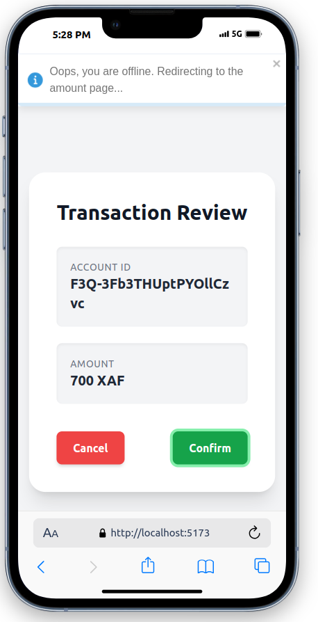
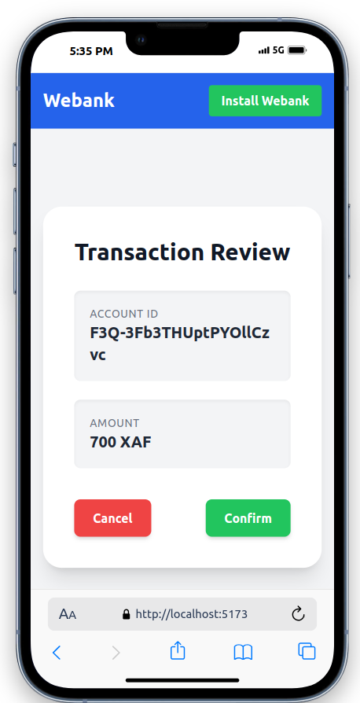

# WeBank App User Workflow Documentation

This document provides a comprehensive overview of the key user flows in the WeBank online banking application. Each section explains the steps from the user’s perspective and includes designated spaces for Screenshots to visually guide the user through the process.

---

## Table of Contents

- [WeBank App User Workflow Documentation](#webank-app-user-workflow-documentation)
  - [Table of Contents](#table-of-contents)
  - [User Registration](#user-registration)
    - [Workflow Steps](#workflow-steps)
  - [View Account Balance](#view-account-balance)
    - [Workflow Steps](#workflow-steps-1)
  - [Bank Transfer](#bank-transfer)
    - [Bank Transfer Flow](#bank-transfer-flow)
  - [Payment Process](#payment-process)
    - [Workflow Steps](#workflow-steps-2)
  - [View Transaction History](#view-transaction-history)
    - [Workflow Steps](#workflow-steps-3)
  - [Top-Up Process](#top-up-process)
    - [For Users](#for-users)
    - [For Agents](#for-agents)
  - [Withdrawal Process](#withdrawal-process)
    - [Workflow Steps](#workflow-steps-4)
  - [Withdrawal Process – Offline Mode](#withdrawal-process--offline-mode)

---

## User Registration

**User Story:**  
_As a user, I want to register for a bank account._

### Workflow Steps

1. **Download & Launch the App**  
   - Download the WeBank app from your app store.  
   - Launch the app.  
   

2. **Enter Registration Details**  
   - Enter your phone number to initiate the registration process.  
   

3. **OTP Verification**  
   - Enter the OTP sent to your phone and click "Verify".  
   

4. **Access Dashboard**  
   - After successful verification, you are redirected to the dashboard, confirming your registration.  
   

---

## View Account Balance

**User Story:**  
_As a user, I want to see my account balance._

### Workflow Steps

1. **Navigate to Dashboard**  
   - Open the WeBank app to access your dashboard.  
   

2. **View Balance**  
   - Click the “View Balance” icon (Eye icon) to display your current balance.  

3. **Balance Display**  
   - Your account balance is shown on the screen.  
   

---

## Bank Transfer

**User Story:**  
_As a user, I want to make a bank transfer from one account to another._

### Bank Transfer Flow

0. **The Recipient Navigates to Dashboard**  
   - Open the WeBank app to access your dashboard.  
   

1. **Recipient Generates QR Code**  
   - The recipient creates a QR code containing their bank ID and shares it via messaging or displays it for scanning.  
   

2. **Scanning the QR Code**  
   - The sender scans the QR code, which redirects them to the transfer page.  
   

3. **Entering Transfer Amount**  
   - The sender inputs the amount to transfer and clicks "Continue".  
   

4. **Confirming Transfer Details**  
   - A confirmation page appears showing the recipient’s account ID and the transfer amount.  
   - The sender reviews the details.  
   

5. **Completing the Transfer**  
   - The sender clicks "Confirm" to finalize the transaction.  
   - A success page displays the transferred amount, transaction ID, time, and payment method.  
   

---

## Payment Process

**User Story:**  
_As a user, I want to pay money to a seller or vendor._

### Workflow Steps

0. **The Seller Navigates to Dashboard**  
   - Open the WeBank app to access your dashboard.  
   

1. **Seller Displays QR Code**  
   - The seller taps “QR Code” to display their unique payment QR code (to be printed and displayed in their shop).  
   

2. **Initiate Payment**  
   - From the dashboard, the payer selects the "Pay" feature.  
   

3. **Scan Seller’s QR Code**  
   - The app opens a scanner page for the payer to scan the seller's QR code.  
   

4. **Enter Payment Amount**  
   - The payer inputs the amount and clicks "Confirm".  
   

5. **Payment Confirmation**  
   - A confirmation page appears showing the seller’s account ID and the transfer amount.  
   - The payer reviews the details.  
   

6. **Completing the Payment**  
   - The payer clicks "Confirm" to finalize the transaction.  
   - A success page displays the transferred amount, transaction ID, time, and payment method.  
   

---

## View Transaction History

**User Story:**  
_As a user, I want to view my transaction history._

### Workflow Steps

1. **Access Transaction History**  
   - From your dashboard, click on the "View Transaction History" button.  
   

2. **Display History**  
   - Your past transactions are listed on the screen.  
   

---

## Top-Up Process

**User Guide:** *How to Add Money to Your WeBank Account*

### For Users

1. **Find an Agent**  
   - Locate a WeBank agent near you.  
   

2. **Navigate to Top-Up**  
   - Open the WeBank app and tap the "Top-Up" button on your dashboard (as a client).  
   

3. **Enter Top-Up Amount**  
   - Input the amount you wish to add to your account.  
   

4. **Proceed with Transaction**  
   - Tap "Continue" (or "Cancel" if you change your mind).  

5. **Display QR Code**  
   - The app generates a QR code that you can show to the agent or download for later use.  
   

6. **Confirmation & Balance Check**  
   - Hand over the cash to the agent.  
   - Once confirmed, return to the dashboard to verify your updated balance.

### For Agents

1. **Access Agent Services**  
   - Log in to the WeBank app and tap "Agent Services" from the side menu.  
   

2. **Select Cash In**  
   - Tap on the "Cash In" button.  
   

3. **Scan User’s QR Code**  
   - Use your device’s scanner or choose "Upload QR Code" to scan the user's QR code.  
   

4. **Confirm Transaction Details**  
   - Verify the user’s account details and the top-up amount.  
   

5. **Finalize the Transaction**  
   - Click "Confirm" to complete the process, or "Cancel" if necessary.  
   - A success message is displayed and the updated balance is visible.  
   

---

## Withdrawal Process

**User Story:**  
_As a user, I want to withdraw money from my account._

### Workflow Steps

1. **Initiate Withdrawal**  
   - The user meets a WeBank agent (in person or remotely via a communication channel that supports QR code ../public/images).  
   - Inform the agent of the withdrawal amount.  
   

2. **Agent Accesses Payout Option**  
   - The agent logs into the WeBank portal and selects the "Payout" option from the sidebar.  
   

3. **Enter Withdrawal Amount**  
   - The agent enters the requested withdrawal amount on the amount page.  
   

4. **Generate QR Code for Confirmation**  
   - A QR code is generated for the user to scan as authorization for the withdrawal.  
   

5. **User Scans the QR Code**  
   - From the dashboard, the user taps the "Withdraw" button.  
   - The app displays a scanner awaiting the QR code.  
   

6. **Review Transaction Details**  
   - After scanning, a summary of the transaction appears for the user to review.  
   

7. **Confirm the Transaction**  
   - With an active internet connection, the user clicks "Confirm" to process the withdrawal.  
   - A success page confirms that the withdrawal was processed successfully.  
   

---

## Withdrawal Process – Offline Mode

When the client is offline, the withdrawal process adapts to ensure that the transaction can still be securely authorized by an online agent. The following steps detail the offline withdrawal workflow:

0. **Handling Offline Withdrawals**  
   - If the user is offline, a pop-up notification appears explaining the connectivity issue and redirects the user to manually enter the withdrawal amount, generating an alternate QR code for authorization.  
   

1. **Redirect to Amount Page**  
   - Since the client is offline, they are redirected to an amount entry page.  
   - The client manually enters the amount they wish to withdraw and clicks "Confirm."  
   

2. **QR Code Generation for Offline Authorization**  
   - After confirming the amount, the app generates a QR code containing the necessary authorization details for the withdrawal.  
   

3. **Handoff to the Online Agent**  
   - The client presents the generated QR code to the online agent.  
   - The agent then selects the "Scan instead" option within the WeBank portal.  
   

4. **Agent Scanning Process**  
   - The agent is navigated to a dedicated "Scan QR Code" page.  
   - Here, they can either capture a live scan or upload the QR code ../public/image provided by the client.  
   - Once the QR code is captured, the agent clicks "Continue."  
   

5. **Transaction Confirmation**  
   - A confirmation page is displayed where the agent reviews the withdrawal details (amount, client information, etc.).  
   - If the details are correct, the agent clicks "Confirm" to authorize the transaction.  
   

6. **Completion and Success Notification**  
   - After the transaction is processed successfully, a success page is displayed.  
   - This page provides the transaction information, including the withdrawn amount, transaction ID, and time of the transaction.  
   
